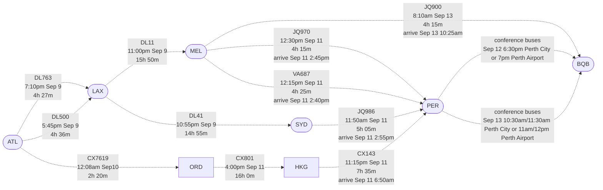
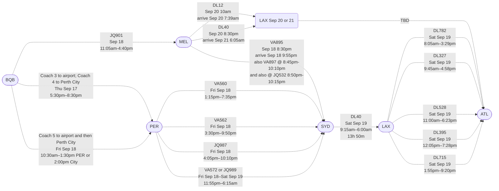

Over the last two weeks, I was visiting Australia for a conference.
It started with just figuring out to travel there! I spent a ton of time diagramming flights. But that's not the point of this story. Let me tell you about how we arrived in the `BQB` Busselton Airport.

I arrived in the Busselton Airport from Melbourne with my friends and colleagues, `A` and `V`.
The plane stopped on the tarmac and the first thing that was unusual was that they actually opened the back doors of the plane at the same time as the front doors.
After a while, I exited the plane through the back door with my backpack and suitcase,
down the stairs, and across the tarmac outside.
I tried to take a picture of my colleague `A` as we were going in, where it said "Busselton." However,
A guy who works there waved his index finger at us to tell us that pictures were not allowed on the tarmac.

We took a few more steps to get off the tarmac and then took the pictures.
Welcome to Busselton!

We went into the small airport which I can only describe as a very large room.
Car rental companies were represented behind their desks to the right.
The exterior doors were opposite us. Checked luggage was arriving from the left.
All the people were shepparded to the middle of the room so that they could get sorted out.

`A` and `V` got their checked luggage and so we started calling for an Uber.
We waited for a long time and most people had vacated the building by then.
The Avis personnel were still working at the counter, however, and so we asked them if Uber was available in this small town.
They replied that there are only _seven_ people working for Uber on this Sunday and so it might take a while. It is 20 minutes to drive into town.
This told us two things: 1) this is a very small town and there is going to be a long wait and 2) they are such a small town that they know everybody!

We went outside for a little bit just to get fresh air and to wait out there.
We went back inside. No wait the airport door was locked. An Avis person let us back inside as soon as she saw us.

I called for a cab and they answered immediately. Hallelujah.
They said that there are five people in front of us.
However, when I asked how long that might mean, she said that they would get to us when they could. Well.
There was one more Avis person who was still working and she was trying to help a man at the counter.
I told the Avis person who was still there that we were fifth in line and she was like honey that will be another hour.

The person who she was helping started chatting us up and offered to drive us into town.
If this were any other situation I would have ignored him - and I did at first!
However, I was surprised that `A` and `V` were open to it and started talking with him.
It turns out that he was borrowing a car because his daughter was borrowing his car!

The price? Push his car to get it back into gear so that his daughter could borrow the car.
When we went outside with him, we found his daughter in the car, sitting in the grassy/dusty parking lot. We learned a little bit about him. His name is Pirmir.
`V`, Pirmir, Avis Lady, and I started pushing the car, and she shot off into the distance. Great. No wait, not great - where is she going?

Where did Pirmir disappear to?

A minute later, he drove up in a new car. It turns out that he was borrowing the car for himself and his daughter was now long gone.
We got all our stuff and loaded up the car, and then we drove off together, Pirmir at the wheel.

We told him how we are from Atlanta and just a few other generic things about us.
We learned he was originally from Switzerland, moved to Ireland for a while, but is now a local and that he loves driving people from the airport.

Just like how we would see cows on the side of the road, we saw kangaroos.
It was a grassy distance and lilies were growing everywhere.
Pirmir took a U-turn on the highway and stopped on the side of the road. We all got out and he took us to see the kangaroos.
He warned us not to get close and so we stayed closed to the road, with them in the distance.
He also taught us how the Lilies are weeds and that cows and other livestock eat them and die. Something about how it clogs up their stomachs.

Anyway, after a quick look and photos, we headed back. He dropped us off at our hotels and we are not murdered.

10 out of 10, would recommend.

