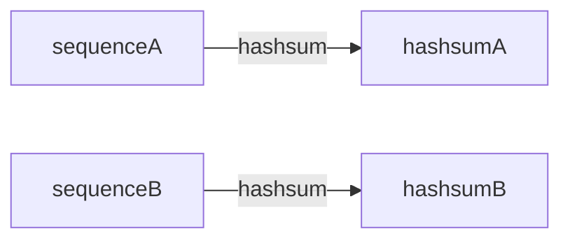

With EToKi and perhaps future MLST callers, we are possibly looking at a new class of MLST databases.

The way we think of MLST databases right now, there is a database of loci,
and each locus has a set of alleles.
The ChewBBACA format is a good example of a classic MLST database structure.
The ChewBBACA format is essentially a folder of fasta files, one per locus.
Each allele has an integer. If the local database finds a new allele, it assigns it a temporary allele number until it can synchronize with other databases.
Therefore, someone can communicate "I have allele number 2 for locus X" and someone will understand exactly what that means. Allele 2 encodes a precise sequence as defined by this synchronized database.
The advantage of this format is that an exact match against any allele gives excellent support for what your query sequence is and that you instantly know the allele integer identifer.
Either this identifier was in the database before you queried, or you had to create a new integer to represent the new sequence.
The disadvantage is that there is necessarily a synchronization step before you can compare your samples vs someone else's.


With EToKi, the database is a different paradigm.
Each locus is represented by a single allele and we assume that all other alleles are within X percentage of the representative.
Therefore, a query against the EToKi database for one locus is against a single allele.
The identifier isn't a simple integer anymore --
it's an md5sum of the sequence of the query.



```text
>locus1_allele1
sequenceA
>locus2_allele5
sequenceB
  
  |
  V

>hashsumA
sequenceA
>hashsumB
sequenceB
```

I love this new paradigm because there is no real need to synchronize alleles anymore.
If you find a new allele, there is no need to send it to me specifically to synchronize with my database.
This is because your new allele has a specific hashsum.
If I ever find this allele myself, it will have the same hashsum.
In fact, if I have a whole genome of allele calls, I can compare it to one of _your_ genomes and know exactly which
alleles are the same and which are different.
I can know this without a comprehensive database that we synchronize.
All I need to know is which hashsum algorithm you used.
Many people use md5sum, for example.

Another huge advantage of this small database is that queries take a very short time.
Classically, a caller would compare a query vs all or many alleles in the database. Now with EToKi, you only compare against one.

One possible disadvantage of this method is that you might have a locus with a large diversity.
For example, what if your threshold is 80% identity, but you have a locus that has diversity up to 70% different than a reference sequence?
In this case, it is up to the curator of the database to include more representative alleles per locus.
Arguably, this is part of the database curation that already has to be done for an MLST database.

## Acknowledgements

Thank you Subin Park for reviewing this post.
