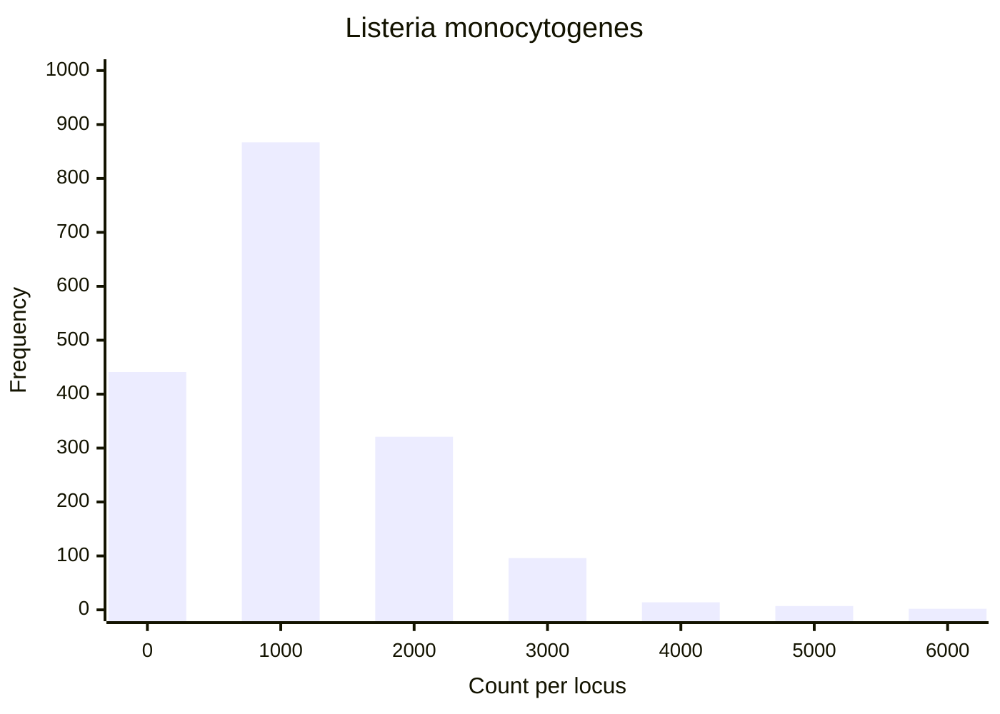
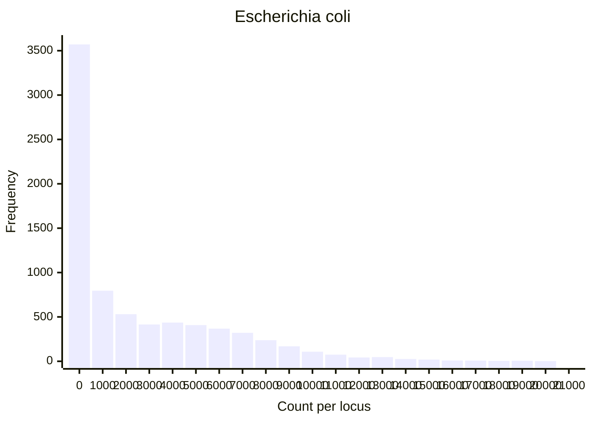
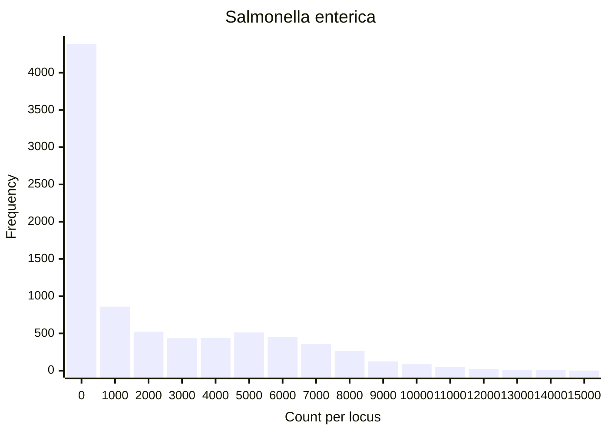

I have talked a bit about hashes with MLST but one crucial issue with hashes is whether they have collisions.
In other words, if we have two sequences, there is a chance although usually a very small chance that they could have the same hashsum.
In an MLST database, this could mean that the distance between any two samples could be smaller than expected: a pair of allele sequences with the same hash could actually be different even though the hashsum is the same.

## First experiment: original databases

In reality this is a very small happenstance... but how small?
I wanted to see if I could observe it with an _in silico_ experiment:

1. Download a large MLST database full of alleles
2. Hashsum all the alleles
3. Detect whether we see any hashsum more than once.

With my [first experiment](https://github.com/lskatz/mlst-hash-template/issues/11),
I downloaded all ten large databases from <chewbbaca.online> that were available at the time.
I hashed all alleles using perl, using a few popular algorithms

```bash
for i in ~/GWA/projects/validation/mlstComparison/MLST.db/*.chewbbaca; do 
  # Ensure all fasta entries are in a two-line-per-entry format and then send them to perl in a tab-separated format of >define \t sequence
  seqtk seq -l 0 <(cat $i/*.fasta) | \
  paste - - | \
  perl -MDigest::MD5=md5_base64 -MDigest::SHA=sha1_base64,sha256_base64 -MString::CRC32=crc32 -lane '
    # Skip if we have seen this sequence already in nucleotide format (it isn't in a hash format yet)
    next if($seen{$F[1]}++); 
    # Print the defline, sequence, and hashsums
    print join("\t", $F[0], $F[1], md5_base64($F[1]), sha1_base64($F[1]), sha256_base64($F[1]), crc32($F[1]));
  ' | \
  gzip -c > t/$(basename $i .chewbbaca).hashes.tsv.gz & done
```

Next, I systematically looked at each column to see if there were duplicates for any scheme.
There were no collisions for SHA1, SHA256, or MD5.
However, I did find collisions with CRC32.
The number of hashsums that were found at least twice were:

* _Acinetobacter baumanii_ had 49 duplicated CRC32 hashes
* _Arcobacter butzleri_ - 3
* _Brucella melitensis_ - no duplicated CRC32 hashes
* _Campylobacter jejuni_ - 11
* _Escherichia coli_ - 1069
* _Listeria monocytogenes_ - 12
* _Salmonella enterica_ (the largest database) - 938
* _Streptococcus agalactiae_ - 11
* _Streptococcus pyogenes_ - 17
* _Yersinia enterocolitica_ - Just 1

I wondered also if we could sidestep the issue by seeing if the hashsums were at least unique within a locus.
In this circumstance, I did not find any hashsum collisions.

## Second experiment: expanded database

Ok so we seem good so far with using hashsums, especially MD5, SHA1, or SHA256.
But what if we expanded the database.
In reality, we are going to find new alleles.
Therefore, 
[I introduced random mutations for each allele tenfold](https://github.com/lskatz/mlst-hash-template/issues/13),
thereby creating databases 11x the original size.

```bash
for i in ~/GWA/projects/validation/mlstComparison/MLST.db/*.chewbbaca; do
  seqtk seq -l 0 <(cat $i/*.fasta) | \
  paste - - | \
  perl -MDigest::MD5=md5_base64 -MDigest::SHA=sha1_base64,sha256_base64 -MString::CRC32=crc32 -lane '
    BEGIN{@NT=qw(A C G T);} 
    next if($seen{$F[1]}++); 
    # Do this 11 times, but one of them will have no mutation
    for my $i(1..11){ 
      $seq=$F[1]; 
      # Don't even bother mutating this allele if we've seen it before
      next if($seen{$seq}++); 
      if($i != 1) {
        substr($seq,rand(length($seq)),1) = $NT[rand(4)];
      } 
      # Don't bother using this mutation of an allele if we've seen it before
      next if($seen{$seq}++); 
      # Print the ID, sequence, hashsums
      print join("\t", $F[0], $seq, md5_base64($seq), sha1_base64($seq), sha256_base64($seq), crc32($seq));
    }
  ' | gzip -c > mutations/$(basename $i .chewbbaca).hashes.tsv.gz & done
```

At this point, I had a spreadsheet similar to experiment 1, but it was much much larger.
Here are the number of alleles after attempting to increase the database 10x but skipping over any duplicate DNA sequence.

```bash
$ for i in *.tsv.gz; do echo -ne "$i\t"; zcat $i | wc -l; done;
Acinetobacter_baumannii.hashes.tsv.gz   5244059
Arcobacter_butzleri.hashes.tsv.gz       613209
Brucella_melitensis.hashes.tsv.gz       83958
Campylobacter_jejuni.hashes.tsv.gz      2273102
Escherichia_coli.hashes.tsv.gz          22182678
Listeria_monocytogenes.hashes.tsv.gz    2797807
Salmonella_enterica.hashes.tsv.gz       21647330
Streptococcus_agalactiae.hashes.tsv.gz  1829511
Streptococcus_pyogenes.hashes.tsv.gz    2776379
Yersinia_enterocolitica.hashes.tsv.gz   1155678
```

E.g., 22M alleles across all loci in the E. coli scheme.

Just like the previous method, I looked to see if there were any collisions.
I won't go over the actual numbers again for brevity but you can see them
[here](https://github.com/lskatz/mlst-hash-template/issues/13).
The bottom line is that there were many collisions with CRC32 but none with the other algorithms.

I wondered also if 11x was enough because there could be loci with just a ton of alleles, beyond what I imagined.
Therefore, I made a histogram of alleles per locus in the 11x databases.
Here are just a few for brevity but [here are the raw data](https://github.com/lskatz/mlst-hash-template/issues/13#issuecomment-1279360900).







So it does look like I might need to look at expanding my view for a very mutated locus if some loci have thousands of alleles.

## Experiment 3: mutating a single locus _ad nauseam_

I took a specific locus that had about average length `INNUENDO_wgMLST-00021749` and wanted to mutate it until I found a collision.

I introduced one to five SNPs (five entries per repetition) for 10^7 repetitions.
This would give me up to 5 x 10^7 entries for a single locus of similar sequences.

```bash
seq="ATGAGCACCGTGACTATTACCGATTTAGCGCGTGAAAACGTCCGCAACCTGACACCGTATCAGTCAGCGCGTCGTCTGGGTGGTAACGGCGATGTCTGGCTGAACGCCAACGAATACCCCTCTGCCGTGGAGTTTCAGCTTACTCAGCAAACGCTCAACCGCTACCCGGAATGCCAGCCGAAAGCGGTGATTGAAAATTACGCGCAATATGCAGGCGTAAAACCGGAACAGGTGCTGGTCAGCCGTGGCGCGGACGAAGGTATTGAACTACTGATTCGCGCTTTTTGCGAACCGGGTAAAGACGCCATCCTCTACTGCCCGCCAACGTACGGCATGTACAGCGTCAGCGCCGAAACCATTGGCGTCAAGTGCCGCACAGTGCCGACGCTGGAAAACTGGCAACTGGACTTACAGGGCATTTCCGACAAGCTGGACGGCGTAAAAGTGGTCTATGTTTGCAGCCCCAACAACCCAACCGGGCAACTGATCAATCCGCAGGATTTTCGCACTCTGCTGGAGTTAACGCGCGGTAAGGCGATTGTGGTTGCCGATGAAGCCTATATTGAGTTTTGCCCGCAGGCCTCGCTGGCGAGCTGGCTGGCGGAATATCCGCACCTGGCTATTTTGCGCACACTTTCGAAAGCTTTTGCTCTGGCGGGGCTTCGTTGCGGATTTACGCTGGCAAACGAAGAGGTCATCAACCTGCTGATGAAAGTGATCGCCCCCTACCCGCTCTCGACGCCGGTTGCCGACATTGCGGCCCAGGCGTTAAGCCCGCAGGGAATCGTCGCTATGCGCGAACGAGTGACGCAAATTATTGCAGAACGCGAATACCTGATTGCCGCACTGAAAGAGATCCCCTGCGTAGAGCAGGTTTTCGACTCCGAAACCAACTACATTCTGGCGCGCTTTAAAGCCTCCAGCGCAGTGTTTAAATCTTTGTGGGATCAGGGCATTATCTTACGTGATCAGAATAAACAACCCTCTTTAAGCGGCTGCCTACGAATTACCGTCGGAACCCGTGAAGAAAGCCAGCGCGTCATTGACGCCTTACGTGCGGAGCAAGTTTGA"
perl -MDigest::MD5=md5_base64 -MDigest::SHA=sha1_base64,sha256_base64 -MString::CRC32=crc32 -e ' 
  # Start with a few basic definitions: nucleotide array, base sequence, and sequence length
  BEGIN{
    @NT=qw(A C G T); 
    $base=substr("'$seq'",0,10000); 
    $seqLength=length($base); 
  } 
  # 10^7 repetitions 
  for my $rep(1..1e7){ 
    # Reset what the sequence is back to the base, to keep it similar with the rest of the alleles
    $seq=$base; 
    # Have 5 mutations per replicate including intermediate sequences of 1, 2, 3, 4, or 5 mutations from the base
    for my $numChanges(1..5){ 
      # make a single random mutation
      substr($seq,rand($seqLength),1) = $NT[rand(4)]; 
      # Don't include this sequence if we've seen it before: we are not testing collisions with identical underlying sequences
      next if($seen{$seq}++); 
      # print a tsv of different hashsums
      print join("\t", $seq, crc32($seq), md5_base64($seq), sha1_base64($seq), sha256_base64($seq))."\n"; 
    }
  }' > hashsums.tsv
```

At the end of this, after skipping over sequences that I had already seen,
I got 22018011 variants of this same locus (about 22M).

Again, I found only collisions with CRC32 and not the other hashing algorithms.
There were 56646 sets of collisions out of the 22M which gave a 0.257% collision rate for this specific locus.

I looked at a couple of collisions and here is just one example of a CRC32 collision. Very similar sequences.

```bash
$ grep 1912652596 hashsums.tsv -m 4
ATGAGCACCGTGACTATTACCGATTTAGCGCGTGAAAACGTCCGCAACCTGACACCGTATCAGTCAGCGCGTCGTCTGGGTGGTAACGGCGATGTCTGGCTGAACGCCAACGAATACCCCTCTGCCGTGGAGTTTCAGCTTACTCAGCAAACGCTCAACCGCTACCCGGAATGCCAGCCGAAAGCGGTGATTGAAAATTACGCGCAATATGCAGGCGTAAAACCGGAACAGGTGCTGGTCAGCCGTGGCGCGGACGAAGGTATTGAACTACTGATTCGCGCTTTTTGCGAACCGGGTAAAGACGCCATCCTCTACTGCCCGCCAACGTACGGCATGTACAGCGTCAGCGCCGAAACCATTGGCGTCAAGTGCCGCACAGTGCCGACGCTGGAAAACTGGCAACTGGACTTACAGGGCATTTCCGACAAGCTGGACGGCGTAAAAGTGGTCTATGTTTGCAGCCCCAACAATCCAACCGGGCAACTGATCAATCCGCAGGATTTTCGCACTCTGCTGGAGTTAACGCGCGGTAAGGCGATTGTGGTTGCCGATGAAGCCTATATTGAGTTTTGCCCGCAGGCCTCGCTGGCGAGCTGGCTGGCGGAATATCCGCACCTGGCTATTTTGCGCACACTTTCGAAAGCTTTTGCTCTGGCGGGGCTTCGTTGCGGATTTACGCTGGCAAACGAAGAGGTCATCAACCTGCTGATGAAAGTGATCGCCCCCTACCCGCTCTCGACGCCGGTTGCCGACATTGCGGCCCAGGCGTTAAGCCCGCAGGGAGTCGTCGCTATGCGCGAACGAGTGACGCAAATTATTGCAGAACGCGAATACCTGATTGCCGCACTGAAAGAGATCCCCTGCGTAGAGCAGGTTTTCGACTCCGAAACCAACTACATTCTGGCGCGCTTTAAAGCCTCCAGCGCAGTGTTTAAATCTTTGTGGGATCAGGGCATTATCTTACGTGATCAGAATAAACAACCCTCTTTAAGCGGCTGCCTACGAATTACCGTCGGAACCCGTGAAGAAAGCCAGCGCGTCATTGACGCTTTACGTGCGGAGCAAGTTTGA     1912652596      OLjbYkT1IXdeYNP4ZDgmsw  A51XRiFrNEjLUnlt6rkRmFijmP0     utqm7Qz+q9frx23XPH+HCPqwaBXIx02SB10vszQHQfQ
ATGAGCACCGTGACTATTACCGATTTAGCGCGTGAAAACGTCCGCAACCTGACACCGTATCAGTCAGCGCGTCGTCTGGGTGGTAACGGCGATGTCTGGCTGAACGCCAACGAATACCCCTCTGCCGTGGAGTTTCAGCTTACTCAGCAAACGCTCAACCGCTACCCGGAATGCCAGCCGAAAGCGGTGATTGAAAATTACGCGCAATATGCAGGCGTAAAACCGGAACAGGTGCTGGTCAGCCGTGGCGCGGACGAAGGTATTGAACTACTGATTCGCGCTTTTTGCGAACCGGGTGAAGACGCCATCCTCTACTGCCCGCCAACGTACGGCATGTACAGCGTCAGCGCCGAAACCATTGGCGTCAAGTGCCGCACAGTGCCGACGCTGGAAAACTGGCAACTGGACTTACAGGGCATTTCCGACAAGCTGGACGGCGTAAAAGTGGTCTATGTTTGCAGCCCCAACAACCCAACCGGGCAACTGATCAATCCGCAGGATTTTCGCACTCTGCTGGAGTTAACGCGCGGTAAGGCGATTGTGGTTGCCGATGAAGCCTATATTGAGTTTTGCCCGCAGGCCTCGCTGGCGAGCTGGCTGGCGGAATATCCGCACCTGTCTATTTTGCGCACACTTTCGAAAGCTTTTGCTCTGGCGGGGCTTCGTTGCGGATTTACGCTGGCAAACGAAGAGGTCATCAACCTGCTGATGAAAGTGATCGCCCCCTACCCGCTCTCGACGCCGGTTGCCGACATTGCGGCCCAGGCGTTAAGCCCGCAGGGAATCGTCGCTATGCGCGAACGAGTGACGCAAATTATTGCAGAACGCGAATACCTGATTGCCGCACTGAGAGAGATCCCCTGCGTAGAGCAGGTTTTCGACTCCGAAACCAACTACATTCTGGCGCGCTTTAAAGCCTCCAGCGCAGTGTTTAAATCTTTGTGGGATCAGGGCATTATCTTACGTGATCAGAATAAACAACCCTCTTTAAGCGGCTGCCTACGAATTACAGTCGGAACCCGTGAAGAAAGCCAGCGCGTCATTGACGCCTTACGTGCGGAGCAAGTTTGA     1912652596      aC5DIgAmzozqoP4gPn0lTw  I+VqPf3mYGf3TkIP1pgKpv82p8Y     RZFOWEaSD1W9GKZZKmBavXXVPBu7z0yLkjSOisEXMss
ATGAGCACCGTGACTATTACCGATTTAGCGCGTGAAAACGTCCGCAACCTGACACCGTATCAGTCAGCGCGTCGTCTGGGTGGTAACGGCGATGTCTGGCTGAACGCCAACGAATACCCCTCTGCCGTGGAGTTTCAGCTTACTCAGCAAACGCTCAACCGCTACCCGGAATGCCAGCCGAAAGCGGTGATTGAAAATTACGCGCAATATGCAGGCGTAAAACCGGAACAGGTGCTGGTCAGCCGTGGCGCGGACGAAGGTATTGAACTACTGATTCGCGCTTTTTGCGAACCGGGTAAAGACGCCATCCTCTACTGCCCGCCAACGTACGGCATGTACAGCGTCAGCGCCGAAACCATTGGCGTCAAGTGCCGCACAGTGCCGACGCTGGAAAACTGGCAACTGGACTTACAGGGCATTTCCGACAAGCTGGACGGCGTAAAAGTGGTCTATGTTTGCAGCCCCAACAACCCAACCGGGCAACTGATCAATCCGCAGGATTTTCGCACTCTGCTGGAGTTAACGCGCGGTAAGGCGATTGTGGTTGCCGATGAAGCCTATATTGAGTTTTGCCCGCAGGCCTCGCTGGCGAGCTGGCTGGCGGAATATCCGCACCTGGCTATTTTGCGCACACTTTCGAAAGCTTTTGCTCTGGCGGGGCTTCGTTGCGGATTTACGCTGGCAAACGAAGAGGTCATCAACCTGCTGATGAAAGTGATCGCCCCCTACCCGCTCTCGACGCCGGTTGCCGACATTGCGGCCCAGGCGTTAAGCCCGCAGGGAATCGTCGCTATGCGCGAACGAGTGACGCAAATTATTGCAGAACGCGAATACCTGATTGCCGCACTGAAAGATATCCCCTGCGTAGAGCAGGTTTTCGACTCCGAAACCAACTACATTCTGGCGCGCTTTAAAGCCTCCAGCGCAGTGTTTAAATCTTTGTGGGATCAGGGCATTATCTTACGCGATCAGAATAAACAACCCTCTTTAAGCGGCTGCCTACGAATTACCGTCGGAACCCGTGAAGAAAGCCAGCGCGTCATTGACGCCTTACGTGCGGAGCAAGTTTGA     1912652596      uyUrAnl6SCZSn6wKXwEKyg  n8mi7pMHXWOJ9gytMT8v5v/PvIs     tNISCfLLESwdyzsTczrV7sWpaV/AMQK374xMd9G1XX4
ATGAGCACCGTGACTATTACCGATTTAGCGCGTGAAAACGTCCGCAACCTGACACCGTATCAGTCAGCGCGTCGTCTGGGTGGTAACGGCGATGTCTGGCTGAACGCCAACGAATACCCCTCTGCCGTGGAGTTTCAGCTTACTCAGCAAACGCTCAACCGCTACCCGGAATGCCAGCCGAAAGCGGTGATTGAAAATTACGCGCAATATGCAGGCGTAAAACCGGAACAGGTGCTGGTCAGCCGTGGCGCGGACCAAGGTATTGAACTACTGATTCGCGCTTTTTGCGAACCCGGTAAAGACGCCATCCTCTACTGCCCGCCAACGTACGGCATGTACAGCGTCAGCGCCGAAACCATTGGCGTCAAGTGCCGCACAGTGCCGACGCTGGAAAACTGGCAACTGGACTTACAGGGCATTTCCGACAAGCTGGACGGCGTAAAAGTGGTCTATGTTTGCAGCCCCAACAACCCAACCGGGCAACTGATCAATCCGCAGGATTTTCGCACTCTGCTGGAGTTAACGCGCGGTAAGGCGATTGTGGTTGCCGATGAAGCCTATATTGAGTTTTGCCCGCAGGCCTCGCTGGCGAGCTGGCTGGCGGAATATCCGCACCTGGCTATTTTGCGCACACTTTCGAAAGCTTTTGCTCTGGCGGGGCTTCGTTGCGGATTTACGCTGGCAAACGAAGAGGTCATCAACCTGCTGATGAAAGTGATCGCCCCCTACCCGCTCTCGACGCCGGTTGCCGACATTGCGGCCCAGGCGTTAAGCCCGCAGGGAATCGTCGCTATGCGCGAACGAGTGACGCAAATTATTGCAGAACGCGAATACCTGATTGCCGCACTGAAAGAGATCCCCTGCGTAGAGCAGGTTTTCGACTCCGAAACCAACTACATTCTGGCGCGCTTTAAAGCCTCCAGCGCAGTGTTTAAATCTTTGTGGGATCAGGGCATTATCTTACGTGATCAGAATAAACAACCCTCTTTAAGCGGCTGCCTATGAATTACCGTCGGAACCCGTGAAGAAAGCCAGCGCGTCATTGACGCCTTACGTGCGGAGCAAGTTTGA 1912652596      /RT87qxo5EzQFwrac12uCg  ix/VY90R+VjAzR8xf4cvC+iD8DY     8hdwIeTPUHm1A4XC1C5QTk5ITmXWys8VzVOReh9Ymiw
```

## Conclusions

I feel like I have at least shown myself that CRC32 is an algorithm to avoid with MLST hashes.
At least for myself, I have shown that MD5, SHA1, and SHA256 are strong enough to avoid collisions with MLST.
